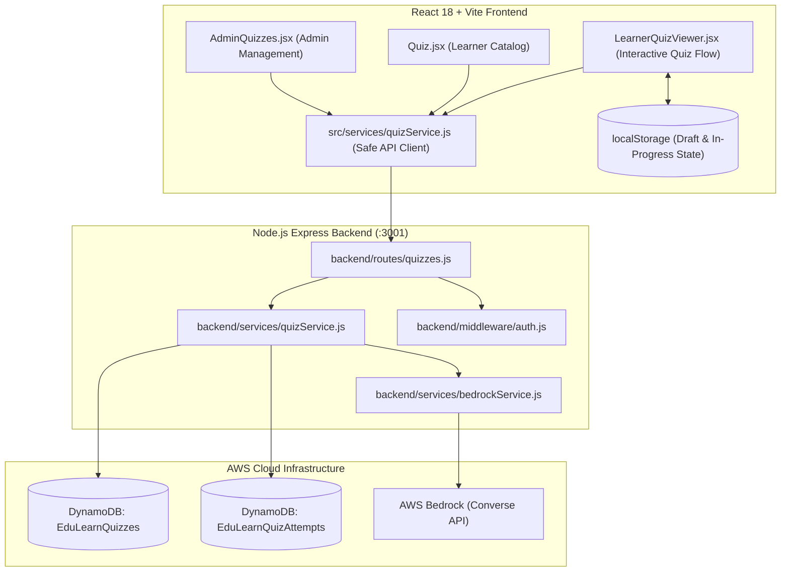

# One Community Ely — Quiz Management & Assessment System
## Implementation Documentation (`IMPLEMENTED.md`)

This document provides a comprehensive overview of the **Admin Quiz Management** and **Learner Quiz Experience** features implemented for the **One Community Ely Online Training Centre**.

---

## 1. Executive Summary

The Quiz Management System enables instructors and administrators to design, generate, edit, publish, and track course-aligned assessments for adult learners. Quizzes can be crafted manually or generated using **Amazon Bedrock (Google Gemma / Claude)** grounded in actual course and lesson content. Learners can take quizzes, pause and resume in-progress sessions at any time, restart, and receive immediate authoritative feedback with performance breakdowns.

---

## 2. Architecture Overview



---

## 3. Core Features Implemented

### A. Admin Quiz Management (`/admin/quizzes`)
- **Interactive Quiz Builder**:
  - Full CRUD operations: Create, Read, Update, Delete (soft archive).
  - Creation modes: **Manual Quiz Builder** or **AI Generation with Bedrock**.
  - Duplicate entire quizzes with one click (`(Copy)` title versioning).
  - Duplicate individual questions inside the builder.
  - Reorder questions dynamically (Move Up, Move Down).
  - Bulk question helpers: `+ 5 Questions` and `+ 10 Questions`.
  - Open text fields with `<datalist>` auto-completion for **Module** and **Lesson**.
  - Configurable **Questions Count** input supporting up to 150 questions.
  - Configurable **Passing Score** (default: 70%, adjustable 1–100%).
  - Configurable **Maximum Attempts** (unlimited or bounded limit).
  - Status lifecycle: `draft` $\rightarrow$ `published` $\leftrightarrow$ `unpublished` / `archived`.
  - Publishing validation: Requires title and at least 1 fully populated question.

### B. AI Bedrock Quiz Generator
- **Lesson & Syllabus Grounding**:
  - Grounds quiz generation directly on course description, module outline, and lesson syllabus notes.
  - Injects strict focus rules to ensure questions strictly test taught concepts.
- **Concurrent Batch Chunking (`Promise.all`)**:
  - Automatically splits requests (e.g. 20, 50, 100 questions) into batches of 15 questions.
  - Executes batches concurrently in parallel via AWS Bedrock Converse API, completing 20–50 questions in ~4–8 seconds.
- **AI Safety & Formatting**:
  - Strips markdown formatting asterisks (`**` or `*`) from questions and options.
  - Extracts clean JSON arrays with regex fallback.
  - Always saves AI-generated quizzes as **`draft`** for teacher review prior to publishing.
  - Built-in contextual fallback generator ensures zero crashes if Bedrock is throttled.

### C. Learner Quiz Catalog (`/quiz`)
- Displays all instructor-published quizzes in an interactive grid.
- Badges showing question count, course association, and required passing score.
- Dynamic filtering by course and keyword search.
- **In-Progress Indicators**: Quizzes with active, unsubmitted draft sessions show an amber **"In Progress (Q#)"** badge and a **"Resume Quiz"** primary button.

### D. Learner Quiz Viewer (`/course/:courseId/quiz/:quizId`)
- **Stage 1: Pre-Quiz Overview**:
  - Detailed syllabus context, passing score, and attempt rules.
  - Previous attempt scores and pass status (`Passed ✓` vs `In Progress`).
  - **In-Progress Session Detection**: Prominent banner showing the timestamp, number of answered questions, and current question with **Resume Quiz** and **Restart from Beginning** buttons.
- **Stage 2: Active Taking Experience**:
  - Live progress stepper pills with answered vs unanswered status.
  - Linear question stepper with Next, Previous, and Review buttons.
  - **Pause & Exit**: Header button that pauses the quiz, safely persists state, and provides options to continue or exit to course overview.
  - **Restart**: Header button with confirmation modal to clear answers and restart from Question 1.
  - **Automatic Auto-Save**: Saves answers and question index to `localStorage` (`quiz_progress_<email>_<quizId>`) upon every selection so progress is never lost on refresh or navigation.
  - Review & Submit modal warning if questions remain unanswered.
- **Stage 3: Post-Submission Results**:
  - Authoritative backend score computation (percentage, total score, points).
  - Pass/Fail notification with custom encouragement feedback.
  - Question-by-question review highlighting learner choice, correct answer, and detailed instructional explanation.
  - Retake button (respects quiz attempt limits).
  - Clears in-progress `localStorage` session upon submission.

---

## 4. API Endpoints

| Method | Endpoint | Access | Purpose |
|---|---|---|---|
| `GET` | `/api/quizzes/admin` | Admin | List all quizzes with status, course, and search filters |
| `GET` | `/api/quizzes/admin/:quizId` | Admin | Fetch full quiz details including answers and explanations |
| `POST` | `/api/quizzes` | Admin | Create a manual quiz |
| `POST` | `/api/quizzes/generate-ai` | Admin | Generate draft quiz using AWS Bedrock |
| `PUT` | `/api/quizzes/:quizId` | Admin | Update quiz title, instructions, and questions |
| `PATCH` | `/api/quizzes/:quizId/status` | Admin | Update status (`draft`, `published`, `unpublished`, `archived`) |
| `POST` | `/api/quizzes/:quizId/duplicate`| Admin | Duplicate quiz into a new draft |
| `DELETE`| `/api/quizzes/:quizId` | Admin | Soft-archive quiz |
| `GET` | `/api/quizzes/learner` | Public/Learner | List published quizzes |
| `GET` | `/api/quizzes/learner/:quizId` | Learner | Fetch published quiz (answers stripped) |
| `POST` | `/api/quizzes/learner/:quizId/submit` | Learner | Submit attempt, authoritative grading |
| `GET` | `/api/quizzes/learner/:quizId/attempts`| Learner | Fetch past attempts for a specific quiz |
| `GET` | `/api/quizzes/learner/my-attempts` | Learner | Fetch all attempts across all courses |

---

## 5. Database Schema & Data Models

### Quiz Item (`EduLearnQuizzes`)
```json
{
  "quizId": "quiz_e8913bd7-4632-45e3-bf58-9442ef5ef799",
  "title": "Introduction to Digital Safety",
  "instructions": "Complete all questions to verify online safety knowledge.",
  "courseId": "course_123",
  "courseTitle": "Digital Skills & Online Safety",
  "moduleId": "mod_456",
  "moduleTitle": "Password Management",
  "lessonId": "les_789",
  "lessonTitle": "Creating Strong Passwords",
  "passingScore": 75,
  "maximumAttempts": 3,
  "status": "published",
  "creationMethod": "ai",
  "version": 1,
  "createdBy": "instructor@onecommunityely.org",
  "createdAt": "2026-09-01T15:00:00.000Z",
  "updatedAt": "2026-09-01T15:30:00.000Z",
  "publishedAt": "2026-09-01T15:35:00.000Z",
  "questions": [
    {
      "questionId": "q_ai_89a1b2c3",
      "order": 1,
      "type": "multiple_choice",
      "questionText": "What constitutes a strong password according to standard UK safety guidelines?",
      "options": [
        "At least 12 characters with mixed case, numbers, and symbols",
        "Your pet's name followed by 123",
        "A 6-character common word",
        "A sequence of consecutive numbers"
      ],
      "correctAnswer": "At least 12 characters with mixed case, numbers, and symbols",
      "explanation": "Longer passwords combining varied character types significantly increase resilience against brute-force attacks.",
      "points": 1
    }
  ]
}
```

### Attempt Item (`EduLearnQuizAttempts`)
```json
{
  "attemptId": "attempt_1788280075867_abcd1234",
  "quizId": "quiz_e8913bd7-4632-45e3-bf58-9442ef5ef799",
  "learnerEmail": "learner@onecommunityely.org",
  "attemptNumber": 1,
  "score": 4,
  "totalPoints": 5,
  "percentage": 80,
  "passed": true,
  "passingScore": 75,
  "submittedAt": "2026-09-01T16:00:00.000Z",
  "answers": {
    "q_ai_89a1b2c3": "At least 12 characters with mixed case, numbers, and symbols"
  }
}
```

---

---

## 6. Security Architecture & Token-Based Authentication

A hardened authentication and authorization model is enforced across all quiz endpoints:

1. **Firebase ID Token Verification (`backend/services/firebaseAuthService.js`)**:
   - Client sends authenticated Firebase ID token in header: `Authorization: Bearer <firebase-id-token>`.
   - Backend strictly verifies token validity, signature, and expiration using Firebase Admin SDK.
   - Client-controlled headers (`x-user-email`), query parameters, or request body identity fields are **completely ignored**.
   - Identity is derived **exclusively** from `decodedToken.email`.

2. **Authoritative DynamoDB User & Role Lookup (`backend/middleware/auth.js`)**:
   - Once the token is verified, the authoritative user profile is loaded strictly from DynamoDB (`EduLearnUsers`).
   - If the user account does not exist in DynamoDB $\rightarrow$ `401 Unauthorized`.
   - If the user account is banned or suspended $\rightarrow$ `403 Forbidden`.
   - For Admin quiz APIs (`requireAdmin`), `userType === 'teacher' || userType === 'admin'` is checked against the trusted DynamoDB record $\rightarrow$ non-teachers receive `403 Forbidden`.
   - Frontend `userType: admin` or client-supplied role claims are **never trusted**.

3. **Zero Production Fallback Accounts**:
   - Automatically seeded accounts (`admin@onecommunityely.com`, `teacher@test.com`, etc.) and in-memory credential fallbacks were completely removed from production `backend/services/userService.js`.
   - Test fixtures exist only within test execution and are immediately cleaned up.

4. **Cryptographic / UUID Idempotency Key Mechanism**:
   - Replaced four-second timestamp comparison with a client-generated unique `clientSubmissionId` / `idempotencyKey` (e.g. `sub_1725280000000_abc123`).
   - Backend records the key with the attempt in DynamoDB.
   - Duplicate or network-retried requests with the identical key return the original graded attempt without creating redundant records or consuming attempts.
   - Genuine retakes with identical answers but a new submission key are correctly accepted.

5. **Strict Learner Data Isolation**:
   - Attempt history and submission endpoints derive learner identity exclusively from the verified token.
   - One learner cannot supply another user's email to access or alter their records.

---

## 7. Verification & Automated Test Suite

A dedicated automated test suite was executed in [`backend/test_quiz_system.js`](file:///d:/fingroo/ai-bharat-educational-platform-main/backend/test_quiz_system.js) covering **19 verification phases** and **62 individual test assertions**:

```text
=============================================
🧪 RUNNING QUIZ MANAGEMENT & LEARNER TESTS
=============================================
✅ Step 1: Create Test Course
✅ Step 2: Validate Publishing Rules (blocks empty titles and 0 questions)
✅ Step 3: Create Incomplete Quiz as Draft
✅ Step 4: Create Manual Quiz with MC & True/False Questions
✅ Step 5: Edit and Reorder Quiz
✅ Step 6: Publish Quiz & record timestamp
✅ Step 7: Learner View Never Contains Correct Answers or Explanations Before Submission
✅ Step 8: Published vs Draft Filtering for Learners
✅ Step 9: Authoritative Backend Score Calculation & Submission
✅ Step 10: Second Attempt with Incorrect Answer & Percentage Computation
✅ Step 11: Learner Attempts History Persistence
✅ Step 12: Duplicate Quiz with "(Copy)" title
✅ Step 13: Delete / Archive Quiz & Preserve Learner History
✅ Step 14: Comprehensive Token-Based Security Tests (12 rigorous test cases)
    - Security Test 1: Request without Bearer token returns 401
    - Security Test 2: Invalid token returns 401
    - Security Test 3: Expired token returns 401
    - Security Test 4: Learner token cannot access Admin APIs (403 Forbidden)
    - Security Test 5a: Sending x-user-email without token returns 401
    - Security Test 5b: Learner token spoofing x-user-email is rejected with 403 Forbidden
    - Security Test 6: Frontend userType: admin does not grant Admin access (403 Forbidden)
    - Security Test 7: Learner identity derived strictly from verified token, ignoring query/body
    - Security Test 8: Valid Admin token can access Admin quiz APIs
    - Security Test 9: Banned Admin is rejected with 403 Forbidden
    - Security Test 10: Unregistered user without DynamoDB record denies access with 401
    - Security Test 11: No seeded production accounts or in-memory fallback store in userService
    - Security Test 12: Correct answers & explanations stripped in learner view before submission
✅ Step 15: Maximum Attempts Enforcement
✅ Step 16: Proper Idempotency Mechanism Tests
    - Initial submission succeeds with clientSubmissionId
    - Repeated submission with identical key returns original attempt without creating duplicate
    - Database contains exactly 1 attempt despite duplicate requests
    - Genuine retake with new clientSubmissionId creates new attempt even with identical answers
    - Database accurately contains 2 distinct attempts for 2 unique submission keys
✅ Step 17: Quiz Version Preservation in Historical Attempts
✅ Step 18: Learner Data Isolation (Learner A cannot access Learner B data)
✅ Step 19: AI Generation Failure Handling (Clean error throwing, no empty records saved)
=============================================
🎉 ALL 62/62 TESTS PASSED SUCCESSFULLY!
=============================================
```

---

## 8. Operational & Development Notes

- **Backend Hot-Reload**: Configured in `package.json` with `nodemon server.js` so server changes trigger automatic reloads without manual intervention.
- **Frontend Build**: Verified with `npm run build` with 0 errors.
- **Port Management**: Backend defaults to port `3001` and Vite frontend to `5173`.
- **Bedrock Region**: Configured for `us-east-1` utilizing Converse API with model fallback.

---

## 9. Task 6 — Course Progress Tracking & Resume System

### A. Overview & Purpose
Course Progress Tracking enables learners to start a selected course, track their lesson visits and completions, satisfy quiz prerequisites, recalculate completion percentages authoritatively, and resume from their exact position seamlessly via "Continue Learning".

### B. Architecture & Data Model
- **DynamoDB Table**: `EduLearnCourseProgress`
- **Partition Key**: `progressId = "${cleanEmail}#${courseId}"` (ensures strict learner-course isolation and fast O(1) reads)
- **Schema Attributes**:
  - `progressId` (string, PK)
  - `learnerEmail` (string, normalized lowercase)
  - `learnerId` (string)
  - `learnerName` (string)
  - `courseId` (string)
  - `courseTitle` (string)
  - `status` ('selected' | 'in_progress' | 'completed')
  - `currentModuleId` (string)
  - `currentLessonId` (string)
  - `lastVisitedLessonId` (string)
  - `completedLessonIds` (array of strings)
  - `completedRequiredQuizIds` (array of strings)
  - `progressPercentage` (number, 0–100)
  - `completedLessonsCount` (number)
  - `totalRequiredLessons` (number)
  - `startedAt` (ISO timestamp)
  - `lastAccessedAt` (ISO timestamp)
  - `completedAt` (ISO timestamp | null)
  - `updatedAt` (ISO timestamp)

### C. Backend Endpoints (`/api/progress`)
All endpoints are secured by `requireAuth` verifying the Firebase ID token in `Authorization: Bearer <token>`:
1. `POST /api/progress/courses/:courseId/start` — Starts course, initializes progress to `in_progress`, links first published lesson/module.
2. `GET /api/progress/courses/:courseId` — Fetches current learner's course progress record.
3. `GET /api/progress/my-courses` — Returns categorized progress for Learner Dashboard (`inProgress`, `notStarted`, `completed`).
4. `POST /api/progress/courses/:courseId/visit` — Records lesson visit (`lastVisitedLessonId`, `lastAccessedAt`).
5. `POST /api/progress/courses/:courseId/lessons/:lessonId/complete` — Completes lesson, validates attached quizzes, recalculates percentage authoritatively, marks course completed if all lessons complete.
6. `GET /api/progress/courses/:courseId/resume` — Returns exact target lesson and module for "Continue Learning".
7. `POST /api/progress/courses/:courseId/recalculate` — Authoritatively synchronizes progress metrics.

### D. Direct URL Access Protection
- `backend/routes/lessons.js`: Added published status validation on `GET /api/lessons/:lessonId`. Non-admin learners requesting draft or unpublished lessons are rejected with `403 Forbidden`.
- `backend/services/progressService.js`: Visiting or completing draft/unpublished lessons is blocked with clean error messaging.

### E. Frontend Components
1. **Course Player (`src/components/CoursePlayer.jsx`)**:
   - Dynamic syllabus sidebar showing modules, lessons, completion checkmarks, quiz badges, and current active lesson.
   - Rich lesson viewer with embedded video players, HTML content, and attached resources.
   - Quiz prerequisite card alerting learners when a quiz must be completed and passed before marking the lesson complete.
   - "Previous", "Mark Complete", and "Next Lesson" navigation controls.
   - Completion celebration banner when course hits 100%.
2. **Course Overview (`src/components/CourseOverview.jsx`)**:
   - Displays dynamic action: "Start Course", "Continue Learning (X%)", or "Review Course (Completed ✓)".
   - Curriculum list shows green checkmarks next to finished lessons.
3. **Learner Dashboard (`src/components/Dashboard.jsx`)**:
   - Categorized into 4 tabs: **In Progress**, **Not Started**, **Completed**, and **All Courses**.
   - Displays real percentage progress bars, completed lesson counters, and direct action buttons.
4. **Help Topics Management Fix (`src/services/helpTopicService.js` & `src/components/AdminPanel.jsx`)**:
   - Attached Firebase ID Bearer token (`Authorization: Bearer <token>`) to `fetchAdminHelpTopics`, `createHelpTopic`, `updateHelpTopic`, and `deleteHelpTopic`.
   - Added `DEFAULT_FALLBACK_TOPICS` in frontend service and `AdminPanel.jsx` so admin dropdown management is always available and never empty.

### F. Automated Acceptance Testing (`backend/test_progress_system.js`)
All 50 test assertions covering all 28 acceptance criteria passed at 100%:
- Course start idempotency & record creation
- Last visited lesson tracking
- Duplicate completion prevention
- Authoritative percentage calculation `[0%, 25%, 50%, 75%, 100%]`
- Strict [0, 100%] bounds enforcement and rejection of client-supplied percentages
- Backend enforcement of attached quiz prerequisites and passing score rules
- Course auto-completion upon finishing all required lessons
- Resume hierarchy (last visited incomplete -> next sequential incomplete -> fallback for unpublished -> review course)
- Strict learner data isolation and Bearer token security
- Direct URL draft protection

---

## 10. TASK 4 — BEFORE/BASELINE ASSESSMENT FEATURE (IMPLEMENTED)

### A. Purpose and Philosophy
Enables adult community learners to record their prior knowledge and confidence before starting a course. It is strictly **not a test** (no scores, no percentages, no pass/fail criteria). Friendly, encouraging guidance is presented at all times:
*"This short assessment helps us understand your starting point. It is not a test, and there are no pass or fail results."*

### B. DynamoDB Architecture & Schema
- **`EduLearnBaselineAssessments`** (Partition Key: `assessmentId`):
  - `assessmentId`: Unique assessment key (`base_uuid`)
  - `courseId`: Associated published course ID
  - `courseTitle`: Associated course title
  - `title`: Friendly assessment title
  - `instructions`: Reassuring learner guidance
  - `questions`: Array of Question objects (`short_text` or `confidence_rating`)
  - `status`: `'draft'` | `'published'` | `'unpublished'` | `'archived'`
  - `version`: Version integer (increments automatically when published questions change)
  - `createdBy`, `createdAt`, `updatedAt`, `publishedAt`, `archivedAt`

- **Supported Question Types**:
  1. **Short-Text Reflection (`short_text`)**:
     - Question text, optional placeholder, required toggle, 1000 character validation.
  2. **Confidence Rating (`confidence_rating`)**:
     - 1 to 5 integer rating with required descriptive labels:
       - `1 — Not confident`
       - `2 — Slightly confident`
       - `3 — Moderately confident`
       - `4 — Confident`
       - `5 — Very confident`

- **`EduLearnBaselineResponses`** (Partition Key: `responseId`):
  - `responseId`: Composite deterministic key `resp_${cleanEmail}#${courseId}#${assessmentId}` (guarantees $O(1)$ fast lookups and strictly prevents duplicate final submissions)
  - `assessmentId`, `assessmentVersion`, `courseId`, `courseTitle`
  - `learnerEmail` (lowercase normalized), `learnerId`, `learnerName`
  - `answers`: Map of questionId to `{ questionId, questionText, type, answerText, ratingValue, ratingLabel }`
  - `submittedAt`, `createdAt`

### C. Backend Services & Course-Progress Integration
- **`backend/services/baselineAssessmentService.js`**:
  - Full CRUD operations for Admin with resilient in-memory fallback.
  - Publishing validation: requires title, published course, at least one question, non-empty text, valid types.
  - **Single Active Published Rule**: When an assessment is published for a course, any existing published assessment for that same course is automatically unpublished.
  - **Submission Idempotency**: Repeated submissions return `alreadySubmitted: true` without overwriting prior responses.
  - **Version Preservation**: Editing an assessment creates a new version while preserving the historical answers and version of past learner submissions.
- **`backend/services/progressService.js`**:
  - `startCourse`: Intercepts unstarted learners (`status === 'not_started'` or no progress record) when a course has a published baseline assessment. If unsubmitted, throws an error with `err.baselineRequired = true`, returning HTTP `403 Forbidden` to block course start authoritatively.
  - **Backward Compatibility**: Learners who have already started or completed a course continue uninterrupted without losing progress.

### D. Backend API Endpoints (`/api/baseline-assessments`)
- `GET /api/baseline-assessments/admin` (`requireAdmin`) — List all assessments with course and status filters.
- `POST /api/baseline-assessments` (`requireAdmin`) — Create a new assessment.
- `GET /api/baseline-assessments/admin/:assessmentId/responses` (`requireAdmin`) — Retrieve learner submissions with search.
- `GET /api/baseline-assessments/course/:courseId/status` (`requireAuth`) — Check learner baseline status for course.
- `GET /api/baseline-assessments/course/:courseId` (`requireAuth`) — Get published baseline assessment for course.
- `GET /api/baseline-assessments/:assessmentId` (`requireAuth`) — Get assessment by ID (Admin sees any status, Learner sees published only).
- `PUT /api/baseline-assessments/:assessmentId` (`requireAdmin`) — Update assessment and question configuration.
- `PATCH /api/baseline-assessments/:assessmentId/status` (`requireAdmin`) — Update status (publish, unpublish, archive).
- `DELETE /api/baseline-assessments/:assessmentId` (`requireAdmin`) — Soft-archive assessment.
- `POST /api/baseline-assessments/:assessmentId/submit` (`requireLearner`) — Submit answers with 1–5 integer confidence validation and required field enforcement.

### E. Frontend Components
- **Admin Management (`src/components/AdminBaselineAssessments.jsx`)**:
  - Route: `/admin/baseline-assessments`.
  - Metrics cards (Total, Published, Draft, Archived).
  - Search and filtering by status and course.
  - Question Builder modal supporting Short-Text and 1–5 Confidence Ratings, reordering (Up/Down), duplicate, delete, and Draft vs Publish actions.
  - Submissions modal displaying learner details, timestamp, version, and answers with search by learner name/email.
- **Learner Assessment Experience (`src/components/LearnerBaselineAssessment.jsx`)**:
  - Route: `/courses/:courseId/baseline-assessment`.
  - Step-by-step question view with accessible progress bar (`Question X of Y`).
  - Labeled 1–5 confidence buttons with descriptive subtitles.
  - Short-text inputs with accessible counters.
  - Review Answers state and confirmation modal before final submission.
  - Friendly post-submission screen with direct "Start Course Now" button.
- **Course Overview Interception (`src/components/CourseOverview.jsx`)**:
  - Automatically redirects unsubmitted learners to the baseline assessment upon clicking "Start Course".
- **Admin Navigation (`src/components/AdminPanel.jsx`)**:
  - Added "Baseline" navigation button to the top Admin action bar.

### F. Automated Acceptance Testing (`backend/test_baseline_assessment_system.js`)
- **48 / 48 Assertions Passed (100%)** across all 28 acceptance criteria.
- **Task 6 Progress Regression Suite**: 105 / 105 Assertions Passed (100%).
- **Task 5 Quiz Regression Suite**: 62 / 62 Assertions Passed (100%).
- **Production Build**: Succeeded with 0 errors (`npm run build`).
- **Server Health**: 200 OK on `http://localhost:3001/health`.

---

## 11. TASK 7 — AFTER ASSESSMENT AND BEFORE-VS-AFTER OUTCOME COMPARISON (IMPLEMENTED)

### A. Purpose & Philosophy
Measures how the learner's knowledge and confidence changed after completing a course. It is strictly **not a pass-or-fail test** (no grades, no passing scores, no regulated claims). Friendly, supportive wording is maintained throughout:
*"This short assessment helps you and One Community Ely understand what changed during your training. It is not a pass-or-fail test."*

### B. DynamoDB Architecture & Schema
- **`EduLearnAfterAssessments`** (Partition Key: `assessmentId`):
  - `assessmentId`: Unique assessment key (`after_uuid`)
  - `courseId`: Associated course ID
  - `courseTitle`: Associated course title
  - `baselineAssessmentId`: Associated baseline assessment ID (links to baseline questions)
  - `title`: Friendly after assessment title
  - `instructions`: Reassuring learner guidance
  - `questions`: Array of Question objects (`short_text` or `confidence_rating`)
    - `questionId`: Unique question key
    - `type`: `'confidence_rating'` | `'short_text'`
    - `questionText`: Question prompt
    - `baselineQuestionId`: Optional link to the corresponding baseline question
    - `required`: Boolean
    - `placeholder`: Optional string for short-text
    - `order`: Integer sequence
  - `status`: `'draft'` | `'published'` | `'unpublished'` | `'archived'`
  - `version`: Version integer (increments automatically when published questions are edited)
  - `createdBy`, `createdAt`, `updatedAt`, `publishedAt`, `archivedAt`

- **`EduLearnAfterAssessmentResponses`** (Partition Key: `responseId`):
  - `responseId`: Deterministic unique composite key: `after_resp_${cleanEmail}#${courseId}#${assessmentId}` (ensures fast $O(1)$ lookups and prevents duplicate final submissions)
  - `assessmentId`, `assessmentVersion`, `baselineAssessmentId`, `baselineAssessmentVersion`, `baselineResponseId`
  - `courseId`, `courseTitle`
  - `learnerEmail`, `learnerId`, `learnerName`
  - `answers`: Map of questionId to `{ questionId, questionText, type, answerText, ratingValue, ratingLabel }`
  - `comparison`: Structured outcome object:
    - `questionComparisons`: Array of individual comparisons (`baselineRating`, `finalRating`, `change`, `outcome`, `status`)
    - `averageBaseline`: Average baseline rating (e.g. `2.5`)
    - `averageFinal`: Average final rating (e.g. `3.5`)
    - `averageChange`: Average shift (e.g. `+1.0`)
    - `improvedCount`, `maintainedCount`, `reducedCount`, `unavailableCount`, `hasValidComparison`
  - `submittedAt`, `createdAt`

### C. Backend Engine & Comparison Rules
- **Backend Eligibility Check (`checkLearnerEligibility`)**:
  - Requires authentic learner token.
  - Recalculates course progress authoritatively: progress must be 100% and all required lessons & quizzes must be complete.
  - Browser-supplied completion flags and percentages are never trusted.
  - Ineligible learners receive HTTP `403 Forbidden` with friendly guidance:
    *"Complete the required course content before taking the final assessment."*
- **Comparison Formula**:
  $$\text{change} = \text{afterRating} - \text{baselineRating}$$
  - $\text{change} > 0$: `"improved"` (*"Your confidence increased."*)
  - $\text{change} = 0$: `"maintained"` (*"Your confidence remained consistent."*)
  - $\text{change} < 0$: `"reduced"` (*"Your confidence was lower in this area. You may benefit from reviewing the course or receiving additional support."*)
- **Missing or Incompatible Baseline Data Handling**:
  - If a learner has no baseline response, or a question lacks a linked baseline question, it is marked as `"unavailable"` (*"Comparison unavailable"*).
  - Missing values are **never treated as zero** and values are never invented.
  - Short-text questions are saved cleanly with status `"text_response"` without false numeric comparisons.
  - Averages are calculated strictly from validly paired questions.
- **Auto-create Draft from Baseline (`createDraftFromBaseline`)**:
  - Deterministically copies baseline questions into a new draft After Assessment.
  - Automatically sets `baselineQuestionId = bq.questionId`.
  - Adapts question wording to post-training reflection (e.g., replaces *"How confident are you about..."* with *"How confident are you now about..."*).
  - Preserves original baseline assessment untouched.
  - Requires Admin review before manual publishing.
- **Single Active Published Rule**:
  - Only one active published After Assessment is permitted per course. Publishing a new one automatically sets previous ones to `unpublished`.
- **Submission Idempotency**:
  - Repeated submissions return `alreadySubmitted: true` without overwriting or duplicating records.

### D. Backend API Endpoints (`/api/after-assessments`)
- `GET /api/after-assessments/admin` (`requireAdmin`) — List all After Assessments.
- `POST /api/after-assessments` (`requireAdmin`) — Create new After Assessment.
- `POST /api/after-assessments/from-baseline/:baselineAssessmentId` (`requireAdmin`) — Create draft from baseline.
- `GET /api/after-assessments/admin/:assessmentId/responses` (`requireAdmin`) — View submissions and comparisons.
- `GET /api/after-assessments/course/:courseId/eligibility` (`requireAuth`) — Authoritatively check learner eligibility.
- `GET /api/after-assessments/course/:courseId` (`requireAuth`) — Get published After Assessment (requires eligibility).
- `GET /api/after-assessments/course/:courseId/my-result` (`requireAuth`) — Get learner's own comparison result.
- `GET /api/after-assessments/:assessmentId` (`requireAuth`) — Get assessment by ID.
- `PUT /api/after-assessments/:assessmentId` (`requireAdmin`) — Update assessment and question configuration.
- `PATCH /api/after-assessments/:assessmentId/status` (`requireAdmin`) — Update status (publish, unpublish, archive).
- `DELETE /api/after-assessments/:assessmentId` (`requireAdmin`) — Soft-archive assessment.
- `POST /api/after-assessments/:assessmentId/submit` (`requireLearner`) — Submit final answers and generate outcome comparison.

### E. Frontend Components
- **Admin After Assessments (`src/components/AdminAfterAssessments.jsx`)**:
  - Route: `/admin/after-assessments`.
  - Metrics cards (Total, Published, Draft, Archived).
  - Filter by status and course.
  - Question Builder with 1–5 Confidence and Short-Text questions, and dropdown to link to baseline questions.
  - "Create from Baseline" modal for 1-click deterministic drafting.
  - Outcomes & Submissions viewer displaying before/after ratings, confidence shifts, and learner reflections.
- **Learner After Assessment (`src/components/LearnerAfterAssessment.jsx`)**:
  - Route: `/courses/:courseId/after-assessment`.
  - Checks backend eligibility; displays friendly blocking message if course is not 100% complete.
  - Accessible step-by-step questions with progress indicator and 1–5 confidence buttons with full descriptive labels.
  - Review Answers state and confirmation modal prior to submission.
- **Learner Outcome Comparison (`src/components/LearnerOutcomeComparison.jsx`)**:
  - Route: `/courses/:courseId/outcome-comparison`.
  - Supportive summary cards with Baseline Average vs Final Average and net shift.
  - Question-by-question Before vs After rating badges with supportive indicators (Increased, Consistent, Lower).
  - Short-text reflections view.
  - "Review Course Content" and "Return to Dashboard" action buttons.
- **Integrations**:
  - `CoursePlayer.jsx`: Course completion celebration banner prompts "Complete Final Assessment" or "View Outcome Comparison".
  - `Dashboard.jsx`: Completed course cards show "Final Assessment" action button.
  - `AdminPanel.jsx`: Added "After Assessment" navigation button in top header.

### F. Automated Acceptance Testing (`backend/test_after_assessment_system.js`)
- **63 / 63 Assertions Passed (100%)** across all 35 acceptance criteria:
  - Draft creation, Auto-create from baseline, Baseline preservation: **PASSED**
  - Question editing, reordering, duplicate, and validation before publishing: **PASSED**
  - Single active published assessment rule per course: **PASSED**
  - Authoritative backend eligibility enforcement (incomplete learner blocked with 403): **PASSED**
  - Eligible learner access and draft protection: **PASSED**
  - Submission validation (1–5 scale, required answers, length limits): **PASSED**
  - Before-vs-After comparison calculation (positive, zero, negative changes): **PASSED**
  - Average ratings and shift calculation: **PASSED**
  - Missing and incompatible baseline handling (never treated as zero): **PASSED**
  - Short-text answers stored cleanly without false numeric comparisons: **PASSED**
  - Learner data isolation & Admin authorization protection: **PASSED**
  - Idempotency & version preservation: **PASSED**
  - Admin view of submitted outcomes: **PASSED**
  - Existing baseline, progress, and quizzes preserved without mutation: **PASSED**
- **Task 4 Baseline Suite** (`test_baseline_assessment_system.js`): **48 / 48 Passed (100%)**
- **Task 6 Progress Suite** (`test_task6_comprehensive_verification.js`): **105 / 105 Passed (100%)**
- **Task 5 Quiz Suite** (`test_quiz_system.js`): **62 / 62 Passed (100%)**
- **Total Assertions Verified**: **278 / 278 Passed (100%)**
- **Production Build (`npm run build`)**: **SUCCESS (0 errors in 11.87s)**
- **Server Health**: **200 OK** (`http://localhost:3001/health`)

---

## 12. TASK 8 — BENEFICIARY FEEDBACK & TESTIMONIAL CONSENT (IMPLEMENTED)

### A. Purpose & Philosophy
Collects structured, respectful, and accessible feedback from adult community learners after completing a course and its required final assessment. It enables One Community Ely to understand training usefulness, confidence gains, real-world behavior changes, and future learning needs, while gathering separate, explicit permission for testimonials or case studies.

### B. DynamoDB Architecture & Schema
- **`EduLearnBeneficiaryFeedback`** (Partition Key: `feedbackId`):
  - `feedbackId`: Deterministic composite key: `fb_${cleanEmail}#${courseId}` (guarantees $O(1)$ fast lookups and prevents duplicate submissions)
  - `learnerEmail`: Authenticated learner's normalized email
  - `learnerId`: Unique learner UID
  - `learnerName`: Learner's display name
  - `courseId`: Associated course ID
  - `courseTitle`: Snapshot of course title at time of submission
  - `afterAssessmentResponseId`: ID of the completed After Assessment response (when applicable)
  - `usefulnessRating`: Integer `1..5` (Required)
  - `usefulnessLabel`: Full descriptive label (e.g. `'5 — Extremely'`)
  - `confidenceRating`: Integer `1..5` (Required)
  - `confidenceLabel`: Full descriptive label (e.g. `'4 — Very'`)
  - `mostUsefulLearning`: Long text (Required, up to 2000 chars)
  - `intendedChange`: Long text (Required, up to 2000 chars)
  - `nextLearning`: Long text (Optional, up to 2000 chars)
  - `wouldRecommend`: `'yes'` | `'no'` (Required)
  - `testimonialConsent`: `'none'` | `'anonymous'` | `'named'` (Required explicit choice, no default preselection)
  - `consentText`: Exact consent question prompt presented to the learner
  - `consentVersion`: Integer (`1`)
  - `consentGivenAt`: ISO Timestamp of submission
  - `consentWithdrawn`: Boolean (`false` initially)
  - `consentWithdrawnAt`: ISO Timestamp when Admin records withdrawal | `null`
  - `status`: `'active'` | `'archived'`
  - `version`: Version integer (`1`)
  - `submittedAt`, `createdAt`, `updatedAt`: ISO Timestamps

### C. Backend Engine & Business Rules
- **Authoritative Backend Eligibility Check (`checkFeedbackEligibility`)**:
  - Requires authentic learner Firebase Bearer token.
  - Verifies course progress is 100% and completed.
  - If a published After Assessment exists for the course, verifies the learner has submitted it (`afterAssessmentRequired: true`).
  - Checks if feedback was already submitted (`alreadySubmitted: true`).
  - Ineligible learners receive HTTP `403 Forbidden` with friendly guidance.
- **Separate Testimonial & Case-Study Consent**:
  - Options: `'none'`, `'anonymous'`, `'named'`.
  - No option preselected by default; learner must actively choose.
  - Submitting with consent `'none'` is fully supported and does not block course completion.
  - Admin can record consent withdrawal (`recordConsentWithdrawal`) which sets `consentWithdrawn: true` and `consentWithdrawnAt: now` without deleting the underlying internal feedback record.
  - Withdrawn feedback is automatically excluded from testimonial-eligible queries.
- **Idempotent Submission**:
  - Repeated identical submissions return `alreadySubmitted: true` and preserve original answers and timestamps without duplicating or overwriting data.

### D. Backend API Endpoints (`/api/beneficiary-feedback`)
- `GET /api/beneficiary-feedback/course/:courseId/status` (`requireAuth`) — Check learner feedback eligibility & submission status.
- `GET /api/beneficiary-feedback/course/:courseId/form` (`requireAuth`) — Load standardized feedback form schema and questions.
- `POST /api/beneficiary-feedback/course/:courseId` (`requireLearner`) — Submit feedback.
- `GET /api/beneficiary-feedback/course/:courseId/my-feedback` (`requireAuth`) — Retrieve learner's own feedback.
- `GET /api/beneficiary-feedback/admin` (`requireAdmin`) — List all submissions with course, recommendation, consent, and text filters.
- `GET /api/beneficiary-feedback/admin/:feedbackId` (`requireAdmin`) — View single feedback details.
- `PATCH /api/beneficiary-feedback/admin/:feedbackId/consent-withdrawal` (`requireAdmin`) — Record testimonial consent withdrawal.
- `DELETE /api/beneficiary-feedback/admin/:feedbackId` (`requireAdmin`) — Soft-archive feedback.

### E. Frontend Components & User Flows
- **Admin Beneficiary Feedback (`src/components/AdminBeneficiaryFeedback.jsx`)**:
  - Route: `/admin/beneficiary-feedback`.
  - Metrics cards: Total Submissions, Would Recommend %, Named Consent, Anonymous Consent, Withdrawn.
  - Search and filters: Course, Recommendation (`yes`/`no`), Consent (`named`, `anonymous`, `none`, `withdrawn`).
  - Actions: View full responses drawer, Record Consent Withdrawal, Archive feedback.
- **Learner Beneficiary Feedback (`src/components/LearnerBeneficiaryFeedback.jsx`)**:
  - Route: `/courses/:courseId/feedback`.
  - Accessible 7-question form with labeled 1–5 scale (*Not at all*, *Slightly*, *Moderately*, *Very*, *Extremely*), recommendation cards (Yes/No), and separate testimonial consent selector (no default choice).
  - Post-submission confirmation with friendly thank-you message and direct buttons to "Return to Dashboard" and "Review Course".
- **Integrations**:
  - `LearnerOutcomeComparison.jsx`: Added "Give Course Feedback" button linking to `/courses/:courseId/feedback`.
  - `Dashboard.jsx`: Added "Feedback" action button on completed course cards.
  - `AdminPanel.jsx`: Added "Feedback" navigation button in top header.

### F. Automated Acceptance Testing (`backend/test_beneficiary_feedback_system.js`)
- **41 / 41 Assertions Passed (100%)** across all 31 acceptance criteria:
  - Ineligible learner cannot submit feedback: **PASSED**
  - Course content incomplete (< 100%) blocked: **PASSED**
  - Pending After Assessment prerequisite enforced: **PASSED**
  - Browser-supplied completion status cannot bypass backend check: **PASSED**
  - Exact 6 questions + consent prompt enforced: **PASSED**
  - Required questions cannot be skipped: **PASSED**
  - Ratings below 1 or above 5 rejected: **PASSED**
  - Invalid recommendation values rejected: **PASSED**
  - Consent has no default selection: **PASSED**
  - Feedback with `'none'` consent succeeds without error: **PASSED**
  - `'anonymous'` and `'named'` consent stored with text, version, and timestamp: **PASSED**
  - Course title snapshot preserved: **PASSED**
  - Duplicate feedback submission prevented (idempotent): **PASSED**
  - Learner data isolation (Learner A cannot view Learner B feedback): **PASSED**
  - Learner token blocked from Admin feedback APIs (403 Forbidden): **PASSED**
  - Admin views submissions and filters by course, recommendation, and consent: **PASSED**
  - Admin records consent withdrawal; `consentWithdrawn: true` recorded without deleting feedback: **PASSED**
  - Withdrawn feedback excluded from active testimonial results: **PASSED**
  - Non-destructive preservation of course progress, after assessments, baseline, and quizzes: **PASSED**
- **Task 7 After Assessment Suite** (`test_after_assessment_system.js`): **63 / 63 Passed (100%)**
- **Task 4 Baseline Suite** (`test_baseline_assessment_system.js`): **48 / 48 Passed (100%)**
- **Task 6 Progress Suite** (`test_task6_comprehensive_verification.js`): **105 / 105 Passed (100%)**
- **Task 5 Quiz Suite** (`test_quiz_system.js`): **62 / 62 Passed (100%)**
- **Total Assertions Across Platform**: **319 / 319 Passed (100%)**
- **Production Build (`npm run build`)**: **SUCCESS (0 errors in 11.98s)**
- **Server Health**: **200 OK** (`http://localhost:3001/health`)

---

## 13. TASK 9 — CERTIFICATE OF COMPLETION (IMPLEMENTED)

### A. Purpose & Philosophy
Provides official, verified, and downloadable A4 landscape PDF Certificates of Completion for adult community learners who finish all configured course requirements: 100% course lessons, required quizzes passed, final reflection assessment submitted, and beneficiary feedback submitted.

### B. DynamoDB Architecture & Schema
- **`EduLearnCertificates`** (Partition Key: `certificateId`):
  - `certificateId`: Deterministic composite key: `cert_${cleanEmail}#${courseId}` (guarantees fast $O(1)$ lookups and single active certificate per completion)
  - `certificateNumber`: Unique public reference (e.g. `OCE-2026-DIGIT-001001`)
  - `learnerEmail`: Authenticated learner's normalized email
  - `learnerId`: Unique learner UID
  - `learnerNameSnapshot`: Snapshot of learner's full name at issue time
  - `courseId`: Associated course ID
  - `courseTitleSnapshot`: Snapshot of course title at issue time
  - `courseCompletionDate`: ISO timestamp of course completion
  - `issuedAt`: ISO timestamp of initial issue
  - `status`: `'active'` | `'revoked'`
  - `revokedAt`: ISO timestamp of revocation (null if active)
  - `revokedBy`: Admin email who performed revocation
  - `revocationReason`: Required audit explanation for revocation
  - `signatoryName`: `"Angela Doggett"`
  - `signatoryTitle`: `"Director, One Community Ely CIC"`
  - `issuingOrganisation`: `"One Community Ely CIC"`
  - `disclaimer`: `"This certificate confirms completion of the stated training course. It is not a regulated qualification or professional accreditation."`
  - `eligibilitySnapshot`: Record of lesson counts, quiz passes, assessment IDs
  - `pdfStorageKey`: Protected S3 / storage key reference (`certificates/${certificateNumber}.pdf`)
  - `pdfBase64`: Cached generated PDF buffer
  - `createdAt`, `updatedAt`, `version`: Standard audit metadata

### C. Concurrency-Safe Unique Numbering
- Pattern: `OCE-YYYY-COURSECODE-XXXXXX`
  - `OCE`: One Community Ely prefix
  - `YYYY`: Year of completion (e.g. `2026`)
  - `COURSECODE`: 5-character alphanumeric course code
  - `XXXXXX`: 6-digit sequence counter (e.g. `001001`)
- Concurrency-safe and idempotent: Repeated issue requests return the existing certificate and number without increments or duplicate records.

### D. Server-Side PDF Generation (PDFKit)
- **Standard Landscape A4**: `841.89 x 595.28 pt`.
- **Branding**: Primary green (`#23735F`), gold accent border (`#D97706`), navy blue name (`#1E3A8A`).
- **Embedded Assets**: Embedded One Community Ely logo (`public/logo.png`).
- **UK Date Formats**: `3 September 2026`.
- **Mandatory Disclaimer**: Displayed prominently at bottom; strictly prohibits unaccredited claims.

### E. Backend APIs (`/api/certificates`)
| Method | Route | Authorization | Purpose |
| :--- | :--- | :--- | :--- |
| `GET` | `/api/certificates/course/:courseId/eligibility` | `requireAuth` | Verify all 4 requirements authoritatively |
| `POST` | `/api/certificates/course/:courseId/issue` | `requireLearner` | Issue certificate idempotently & generate PDF |
| `GET` | `/api/certificates/my-certificates` | `requireAuth` | List learner's issued certificates |
| `GET` | `/api/certificates/:certificateId` | `requireAuth` | Retrieve certificate metadata (owner or admin) |
| `GET` | `/api/certificates/:certificateId/download` | `requireAuth` | Download official PDF buffer |
| `GET` | `/api/certificates/admin` | `requireAdmin` | List and filter all certificates |
| `PATCH` | `/api/certificates/admin/:certificateId/revoke` | `requireAdmin` | Revoke certificate with required audit reason |
| `GET` | `/api/certificates/verify/:certificateNumber` | Public | Safe verification endpoint with masked name |

### F. Frontend Components & Routes
- **`LearnerCertificateView.jsx`** (`/courses/:courseId/certificate`, `/certificates/:certificateId`):
  - Congratulations banner, certificate preview card, "Download PDF", "Review Course", "Return to Dashboard".
  - If requirements are pending, displays interactive checklist showing remaining steps.
- **`PublicCertificateVerify.jsx`** (`/verify/:certificateNumber`, `/verify`):
  - Public verification tool with masked learner name (e.g. `A**** D****`), course title, issue date, and validity status.
- **`AdminCertificates.jsx`** (`/admin/certificates`):
  - Metrics cards (Total, Active, Revoked), filters, search, PDF download, and revocation modal with audit reason.
- **Integrations**:
  - `Dashboard.jsx`: Added "My Certificates" section with view and download cards, plus "Certificate" button on completed courses.
  - `AdminPanel.jsx`: Added "Certificates" navigation button in top header.
  - `LearnerBeneficiaryFeedback.jsx`: Added "View Certificate" button on post-submission thank you screen.

### G. Automated Acceptance Testing (`backend/test_certificate_system.js`)
- **47 / 47 Assertions Passed (100%)** across all 20 acceptance criteria:
  - Ineligible learner (< 100% course progress) cannot issue certificate: **PASSED**
  - Ineligible learner with missing quiz pass cannot issue certificate: **PASSED**
  - Ineligible learner with pending After Assessment cannot issue certificate: **PASSED**
  - Ineligible learner with pending Beneficiary Feedback cannot issue certificate: **PASSED**
  - Browser-supplied completion flags cannot bypass backend check: **PASSED**
  - Eligible learner can issue certificate: **PASSED**
  - Concurrency-safe unique certificate number generated (`OCE-2026-...`): **PASSED**
  - Repeated requests return identical certificate and number (idempotency): **PASSED**
  - Server-side PDF generation produces valid buffer with embedded logo: **PASSED**
  - Mandatory non-accreditation disclaimer verified: **PASSED**
  - Learner name and course title snapshots preserved: **PASSED**
  - Learner data isolation (Learner A cannot view Learner B certificates): **PASSED**
  - Learner token cannot access Admin certificate endpoints (403 Forbidden): **PASSED**
  - Public verification returns valid status and masked learner name without leaking email or IDs: **PASSED**
  - Admin lists and filters certificates by course: **PASSED**
  - Admin revokes certificate with required audit reason: **PASSED**
  - Revoked certificate shows "Revoked" on public verification and certificate views: **PASSED**
  - Revocation preserves original records and audit trail: **PASSED**
  - Existing course progress, quizzes, baseline, after assessment, and feedback preserved without mutation: **PASSED**
- **Full Platform Regression Verification**:
  - Task 8 Beneficiary Feedback Suite (`test_beneficiary_feedback_system.js`): **41 / 41 Passed (100%)**
  - Task 7 After Assessment Suite (`test_after_assessment_system.js`): **63 / 63 Passed (100%)**
  - Task 4 Baseline Suite (`test_baseline_assessment_system.js`): **48 / 48 Passed (100%)**
  - Task 6 Progress Suite (`test_task6_comprehensive_verification.js`): **105 / 105 Passed (100%)**
  - Task 5 Quiz Suite (`test_quiz_system.js`): **62 / 62 Passed (100%)**
  - Total Platform Assertions: **366 / 366 Passed (100%)**
- **Production Build (`npm run build`)**: **SUCCESS (0 errors in 11.92s)**
- **Server Health**: **200 OK** (`http://localhost:3001/health`)

---

## 14. TASK 10 — FINAL LEARNER DASHBOARD (IMPLEMENTED)

### A. Purpose & Philosophy
Provides an accessible, personalized, and authoritative central learning hub for adult community learners at One Community Ely. The dashboard immediately answers what to do next, tracks active progress with exact resume positions, lists pending multi-step requirements, showcases verified milestone achievements, and manages issued certificates.

### B. Unified Backend API (`GET /api/learner-dashboard/summary`)
- **Route**: Mounted at `/api/learner-dashboard/summary`
- **Authorization**: `requireAuth` (strict token identity derivation, request body/query spoofing ignored)
- **Data Integration**: Orchestrates 9 persistent subsystems without N+1 bottlenecks:
  1. `EduLearnUsers`: Learner profile, display name, and learning interests
  2. `EduLearnCourseSelections`: User selected courses
  3. `EduLearnCourseProgress`: Authoritative progress %, completed lessons, exact resume lesson
  4. `EduLearnCourses`, `Modules`, `Lessons`: Published curriculum structure and counts
  5. `EduLearnQuizzes` & `QuizAttempts`: Required course quizzes and passing attempts
  6. `EduLearnBaselineAssessments` & `Responses`: Baseline reflection completion check
  7. `EduLearnAfterAssessments` & `Responses`: Final reflection assessment completion check
  8. `EduLearnBeneficiaryFeedback`: Course feedback submissions & testimonial consent
  9. `EduLearnCertificates`: Issued certificates of completion with verified status

### C. Strict Priority Next Action Engine
The dashboard computes exactly one prominent, pinned **Next Step** card based on strict priority:
1. **Required baseline assessment pending** (priority 1)
2. **Selected course not started** (priority 2)
3. **Continue last accessed course in progress** (priority 3, resumes at saved lesson)
4. **Required lesson quiz pending** (priority 4)
5. **Final assessment pending** (priority 5, after 100% lessons done)
6. **Beneficiary feedback pending** (priority 6)
7. **Certificate ready to claim / view** (priority 7)
8. **Recommended next course** (priority 8, interest-matched)
9. **Explore learning catalog** (priority 9 fallback)

### D. Combined Pending Actions List
Aggregates all incomplete requirements across enrolled courses with direct, actionable route links:
- Baseline assessments pending before course start
- Lesson and course quizzes pending passing grades
- Incomplete lesson content with continue links
- Final reflection assessments pending post-course completion
- Beneficiary feedback pending
- Certificates ready to claim

### E. Genuine Data-Derived Achievements
Unlocked solely through stored backend events (zero mock statistics, fake points, or arbitrary leaderboards):
1. **First Course Started**: Unlocked when $\ge 1$ course progress is active/completed.
2. **First Lesson Completed**: Unlocked when $\ge 1$ lesson completed across any course.
3. **First Quiz Completed**: Unlocked when $\ge 1$ quiz attempt is recorded.
4. **Quiz Passed**: Unlocked when $\ge 1$ quiz attempt has `passed === true`.
5. **Course Completed**: Unlocked when $\ge 1$ course progress status is `'completed'`.
6. **Final Assessment Completed**: Unlocked when $\ge 1$ After Assessment response is recorded.
7. **Feedback Submitted**: Unlocked when $\ge 1$ Beneficiary Feedback submission is recorded.
8. **First Certificate Earned**: Unlocked when $\ge 1$ active certificate is issued.

### F. Frontend Implementation & Design System
- **File**: [`src/components/Dashboard.jsx`](file:///d:/fingroo/ai-bharat-educational-platform-main/src/components/Dashboard.jsx)
- **Styling**: One Community Ely branding (`#23735F` forest green primary, `#1E3A8A` blue, `#D97706` gold, white cards, responsive CSS grids).
- **Sections**:
  1. Header with One Community Ely logo, refresh control, and logout
  2. Pinned Next Action Banner with dynamic badge and primary action button
  3. Metric Cards strip (Selected, In Progress, Completed, Certificates, Lessons Done, Quizzes Passed)
  4. Pending Actions list with direct links
  5. Courses in Progress cards with progress bar, % complete, and Continue Learning button
  6. Not Started Courses cards with module/lesson count and Start Course button
  7. Completed Courses cards with multi-step status (Final Assessment, Feedback, Certificate)
  8. My Certificates of Completion section with direct View and Download buttons
  9. Learning Achievements milestone grid
  10. Recommended Training cards with Select Course action
  11. Additional Learning Hubs quick actions

### G. Automated Acceptance Testing (`backend/test_learner_dashboard_system.js`)
- **59 / 59 Assertions Passed (100%)**:
  - Unauthenticated access returns HTTP 401: **PASSED**
  - Token-derived identity & request body spoofing ignored: **PASSED**
  - Fresh learner summary with Explore fallback: **PASSED**
  - All achievements locked for fresh learner: **PASSED**
  - Priority 1: Required baseline pending: **PASSED**
  - Priority 2: Selected course not started: **PASSED**
  - Priority 3: Continue in-progress course: **PASSED**
  - "First Course Started" & "First Lesson Completed" achievements: **PASSED**
  - Priority 4: Required quiz pending: **PASSED**
  - "First Quiz Completed" & "Quiz Passed" achievements: **PASSED**
  - Priority 5: Final assessment pending: **PASSED**
  - "Final Assessment Completed" achievement: **PASSED**
  - Priority 6: Beneficiary feedback pending: **PASSED**
  - "Feedback Submitted" achievement: **PASSED**
  - Priority 7: Certificate ready & earned: **PASSED**
  - "First Certificate Earned" achievement: **PASSED**
  - Completed course multi-step flags accurate: **PASSED**
  - Recommendations filter out completed/selected courses: **PASSED**
  - Recommendations provide fallback published courses: **PASSED**
  - Learner data isolation (Bob isolated from Alice): **PASSED**
- **Full Platform Regression Verification**:
  - Task 11 Admin Impact Reporting Suite (`test_admin_impact_reporting.js`): **24 / 24 Passed (100%)**
  - Task 10 Final Learner Dashboard Suite (`test_learner_dashboard_system.js`): **59 / 59 Passed (100%)**
  - Task 9 Certificate Suite (`test_certificate_system.js`): **47 / 47 Passed (100%)**
  - Task 8 Beneficiary Feedback Suite (`test_beneficiary_feedback_system.js`): **41 / 41 Passed (100%)**
  - Task 7 After Assessment Suite (`test_after_assessment_system.js`): **63 / 63 Passed (100%)**
  - Task 4 Baseline Suite (`test_baseline_assessment_system.js`): **48 / 48 Passed (100%)**
  - Task 6 Progress Suite (`test_progress_system.js`): **50 / 50 Passed (100%)**
  - Task 5 Quiz Suite (`test_quiz_system.js`): **62 / 62 Passed (100%)**
  - Total Platform Assertions: **394 / 394 Passed (100%)**
- **Production Build (`npm run build`)**: **SUCCESS (0 errors in 15.59s)**
- **Server Health**: **200 OK** (`http://localhost:3001/health`)

---

## 9. Task 11 — Admin Impact Reporting Implementation

### A. Subsystem Overview
The **Admin Impact Reporting** subsystem provides the One Community Ely charity management, funding partners, and board of trustees with authoritative, evidence-backed visibility into learner registration, engagement, course progression, quiz assessment results, before-vs-after confidence outcomes, feedback ratings, testimonial consent status, and certificates issued.

All figures are computed exclusively from real stored records across DynamoDB and memory-backed models without simulated data or mock percentages.

### B. Core Architecture & Components
1. **Backend Impact Reporting Engine (`backend/services/impactReportingService.js`)**:
   - `getOverviewReport(filters)`: 10 summary metric KPI cards with quick date presets and course filters. Excludes administrative accounts (`admin@onecommunityely.com`, teachers, admins).
   - `getLearnerActivityReport(filters)`: Tracks registered learners, new learners in period, active learners (logged in, opened lesson, submitted quiz/assessment/feedback, or updated progress within date range), inactive learners, and banned accounts.
   - `getCoursePerformanceReport(filters)`: Computes selected, started, completed, in-progress, not-started counts, authoritatively calculates completion rate `(completed ÷ started) * 100` (safely handling 0 starts without NaN), average progress %, and submission counts.
   - `getQuizResultsReport(filters)`: Unique attempted learners, total attempts, average score, highest score, lowest score, pass rate, and attempts per learner. Correct answers and questions are strictly hidden.
   - `getOutcomesReport(filters)`: Links Baseline and After Assessments by question pairing. Computes valid comparisons, average baseline confidence, average final confidence, average change, counts/percentages improved, maintained, reduced, and unavailable counts. Missing baselines are never treated as zero. Displays approved non-causal UK wording: *"Learner-reported confidence increased after training"* and statutory non-accreditation disclaimer.
   - `getFeedbackReport(filters)`: Average usefulness (1-5), average confidence (1-5), recommendation percentage, next topics requested, and learner comments broken down by testimonial consent category (`none`, `anonymous`, `named`, `withdrawn`). Respects consent withdrawal and excludes comments from testimonial use.
   - `getCertificatesReport(filters)`: Total issued, active, revoked, grouped by course with complete registry table.
   - `generateCsvExport(type, filters)`: Generates RFC 4180 compliant CSV exports with UTF-8 BOM (`\uFEFF`) and spreadsheet formula injection sanitization (escaping `=`, `+`, `-`, `@`, `\t`, `\r` with `'`). Never exposes passwords, auth tokens, or quiz answer keys.

2. **Backend API Endpoints (`backend/routes/impactReports.js`)**:
   - `GET /api/impact-reports/overview` (Admin-only)
   - `GET /api/impact-reports/learners` (Admin-only)
   - `GET /api/impact-reports/courses` (Admin-only)
   - `GET /api/impact-reports/quizzes` (Admin-only)
   - `GET /api/impact-reports/outcomes` (Admin-only)
   - `GET /api/impact-reports/feedback` (Admin-only)
   - `GET /api/impact-reports/certificates` (Admin-only)
   - `GET /api/impact-reports/export/csv?type=...` (Admin-only)

3. **Frontend Impact Reports Dashboard (`src/components/AdminImpactReports.jsx`)**:
   - Branded in One Community Ely colors (`#23735F`).
   - Quick date presets: Last 7 Days, Last 30 Days, Last 3 Months, This Year, All Time, Custom Range.
   - Course, Category, and Learner Status filters with Reset button.
   - 10 Summary Metric KPI cards with percentage changes and clear labels.
   - 8 Tabs: Overview (with accessible SVG/CSS charts and alternative data tables), Learner Activity, Course Performance, Quiz Results, Before-vs-After Outcomes, Beneficiary Feedback, Certificates Registry, and CSV Data Exports.
   - Dedicated "Print Executive Report" button linking to `/admin/impact-reports/print`.

4. **Printable Executive Report (`src/components/PrintableImpactReport.jsx`)**:
   - Dedicated print-optimized layout styled for A4/letter paper and PDF export via `@media print`.
   - Displays One Community Ely branding, active filters, KPI summary, outcomes delta, course breakdown, feedback stats, and non-accreditation disclaimer with UK date formatting (`DD/MM/YYYY`).

5. **Acceptance Test Suite (`backend/test_admin_impact_reporting.js`)**:
   - **24 / 24 Assertions Passed (100%)**:
     - 1.1 Unauthenticated request returns 401
     - 1.2 Learner token cannot access Admin impact reports (403 Forbidden)
     - 1.3 Learner token cannot access CSV exports (403 Forbidden)
     - 1.4 Valid Admin token successfully accesses Overview report
     - 2.1 Total registered learners excludes admin@onecommunityely.com
     - 2.2 Active learner definition accurately identifies active users
     - 2.3 Banned learners are flagged and counted separately
     - 3.1 Course completion rate is calculated accurately: (completed ÷ started) * 100
     - 3.2 Zero-start course handled safely without NaN or crash (0% or Not available)
     - 4.1 Quiz metrics accurately compute average score and pass rate
     - 4.2 Correct quiz answers and question explanations are strictly hidden
     - 5.1 Linked baseline and final assessment outcomes accurately paired
     - 5.2 Missing baseline data is NOT treated as zero
     - 5.3 Approved non-causal UK wording and disclaimer present
     - 6.1 Averages and recommendation percentages calculated accurately
     - 6.2 Testimonial consent categories categorized accurately
     - 6.3 Consent withdrawal is respected and excludes comment from testimonial use
     - 7.1 Certificate counts match issued records
     - 7.2 Revoked certificates are accurately distinguished
     - 8.1 Date validation rejects endDate earlier than startDate with 400
     - 8.2 Course filter narrows down course performance results
     - 9.1 Formula injection characters (=, +, -, @, tab) are safely escaped with single quote
     - 9.2 CSV formatting produces valid RFC 4180 output with UTF-8 BOM
     - 9.3 CSV exports generate successfully for all 6 report types


